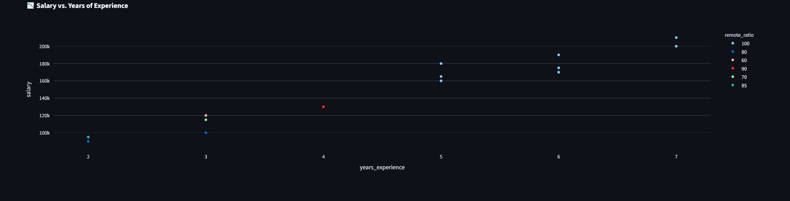

# 🇳🇬 Nigerian Tech Salaries Dashboard

[](https://nigerian-tech-salaries.onrender.com)
[](https://render.com)
[](LICENSE)

A fully interactive Streamlit dashboard analyzing Nigerian tech salaries, built with:
- 📊 **Plotly** for rich interactive charts  
- 🗄️ **PostgreSQL** for cloud-hosted database  
- ☁️ **Render** for deployment  
- 🐍 **Python** + **Pandas** for data wrangling

---

## 🔗 Live Demo

👉 [Click here to view the live app](https://nigerian-tech-salaries.onrender.com)

---

## 📊 Dashboard Preview

### Full Dashboard


### Salary by Job Title


### Salary vs Experience



---

## 📁 Dataset Metadata

- **Filename**: `nigerian_tech_salaries.csv`
- **Size**: 15 rows × 7 columns  
- **Date Collected**: July 2025  
- **Source**: Manually compiled and cleaned sample dataset for demonstration

### 📐 Columns

| Column             | Description                          |
|--------------------|--------------------------------------|
| job_title          | Tech role (e.g., Software Engineer)  |
| experience_level   | Entry, Mid, Senior, etc.             |
| company            | Company name                         |
| location           | City or remote                       |
| remote_ratio       | Percentage of remote work            |
| salary             | Monthly salary in NGN                |
| currency           | Currency used (NGN, USD, etc.)       |

### 🧹 Cleaning Steps

- Removed rows with missing or zero salary values  
- Standardized column names and formatting  
- Converted experience levels to lowercase categories  
- Filtered outliers above 10M NGN/month  

---

## 🛠️ Setup Instructions

1. **Clone the Repository**

```bash
git clone https://github.com/Samhanzy/Nigerian-Tech-Salaries.git
cd Nigerian-Tech-Salaries
Install Dependencies

pip install -r requirements.txt
Set Up PostgreSQL

Create a database: tech_salaries_db

Run the SQL scripts in db/ to create the table and insert the data.

Run the Dashboard

streamlit run dashboard/app.py
🗂️ Project Structure
Nigerian-Tech-Salaries/
│
├── dashboard/
│   ├── app.py                 # Streamlit dashboard
│   └── images/                # Screenshot assets
│
├── data/
│   ├── tech_salaries.csv      # Raw dataset
│   └── upload_data.py         # Script to upload data
│
├── db/
│   ├── create_table.sql       # SQL schema
│   └── insert_data.sql        # Sample inserts
│
├── requirements.txt
├── README.md
└── .gitignore
📄 License
This project is licensed under the MIT License.

🙌 Credits
Made with 💻 by Samhanzy
Deployed on Render
