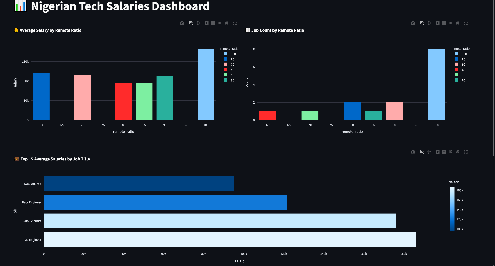
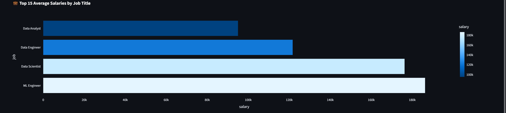

# 🇳🇬 Nigerian Tech Salaries Dashboard

An interactive data dashboard that visualizes salary trends in Nigeria’s tech industry, built with **PostgreSQL**, **Python**, and **Streamlit**. This project combines data engineering, backend SQL, and a modern frontend dashboard to provide insights into job roles, pay, experience, remote work, and more.

🔗 **Live Demo**: [nigerian-tech-salaries.onrender.com](https://nigerian-tech-salaries.onrender.com/)

---

## 📊 Features

- View average salary by job title
- Explore salary distribution by experience
- Compare remote vs. on-site job trends
- Visualize salary vs. experience scatterplot
- Clean, fast-loading interactive dashboard

---

## 🧱 Tech Stack

| Layer         | Tools / Frameworks                               |
|--------------|---------------------------------------------------|
| **Frontend**  | Streamlit, Plotly                                |
| **Backend**   | PostgreSQL, Psycopg2                              |
| **Data**      | CSV to PostgreSQL import, Pandas                 |
| **Deployment**| Render (Free Hosting)                            |
| **Language**  | Python                                            |

---

## 🗂️ Project Structure

nigerian-tech-salaries/
├── api/ # (Future use) REST API endpoints
├── dashboard/ # Streamlit app files
│ └── app.py
├── data/ # Source dataset (CSV)
│ └── tech_salaries.csv
├── db/ # SQL scripts
│ └── create_table.sql
│ └── insert_data.sql
├── notebooks/ # Optional Jupyter analysis
├── .gitignore
├── LICENSE
├── README.md
└── requirements.txt
## 📊 Dashboard Preview



### Salary by Job Title


### Salary vs. Experience


yaml
Copy
Edit
## 📁 Dataset Metadata

- **Filename**: `nigerian_tech_salaries.csv`
- **Size**: _[15]_ rows × _[7]_ columns
- **Date Collected**: _[e.g., July 2025]_

### 📐 Columns
| Column             | Description                          |
|--------------------|--------------------------------------|
| job_title          | Tech role (e.g., Software Engineer)  |
| experience_level   | Entry, Mid, Senior, etc.             |
| company            | Company name                         |
| location           | City or remote                       |
| remote_ratio       | Percentage of remote work            |
| salary             | Monthly salary in NGN                |
| currency           | Currency used (NGN, USD, etc.)       |

### 🧹 Cleaning Steps
- Removed rows with missing or zero salary values
- Standardized column names and formatting
- Converted experience levels to lowercase categories
- Filtered outliers above 10M NGN/month


---

## 🛠️ Setup Instructions

1. **Clone the Repo**

```bash
git clone https://github.com/Samhanzy/nigerian-tech-salaries.git
cd nigerian-tech-salaries
Install Dependencies

bash
Copy
Edit
pip install -r requirements.txt
Set Up PostgreSQL

Create a database: tech_salaries_db

Run the SQL scripts in db/ to create the table and insert the data.

Run the Dashboard

bash
Copy
Edit
streamlit run dashboard/app.py
📌 Dataset
The data used comes from a cleaned CSV file of tech salary records in Nigeria, including:

Job Title

Salary

Experience

Remote Ratio

Employment Type

Company

Location

📷 Screenshots
Overview	Experience vs Salary

(Replace these links with actual screenshots once uploaded to GitHub or Imgur)

📄 License
This project is licensed under the MIT License.

🙌 Credits
Made with 💻 by Samhanzy
Deployed on Render
